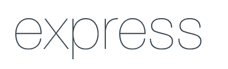
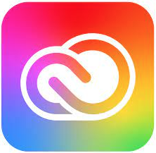
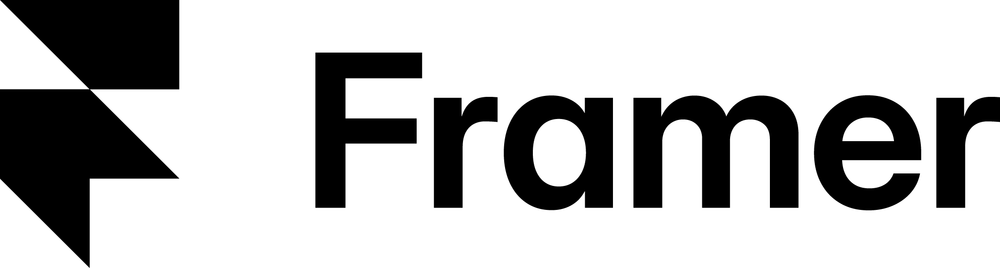

# Hi, I'm Anu! 
  
## [Junior Application Developer](https://github.com/AnuPaivansade), [Supply Chain Professional](https://www.linkedin.com/in/anupaivansade) and 3rd year student in Business Information Technology

I'm a Business Information Technology student with a strong background in international transport and supply chain management.  

I'm interested in **application development, web dev technologies, and automation solutions**, and I love exploring how technology can make everyday tasks smarter and more efficient.  

I have hands-on experience with **React, TypeScript, Node.js**, and basic skills in **UIPath Studio**. Currently, I'm expanding my knowledge in **Power Platform** to build workflow automations and apps that solve real-world problems.  

💡 I enjoy creating tools that make life easier — from planning a weekly meal schedule or managing a personal budget, to automating repetitive work tasks like data entry and reporting. Focusing on practical ways to improve everyday tasks and business processes motivates me to keep learning.

  
## 👨‍💻 Application Projects

- **Web-development**

  - Weekly Sauna Scheduler
    - 🔗[Live Application](https://anupaivansade.github.io/Reserve_Weekly_Sauna/)
    - :hammer_and_wrench: [Source Code & Presentation of the Project](https://github.com/AnuPaivansade/Reserve_Weekly_Sauna)
    - ℹ️ _**Note:** The backend is hosted on Render (free tier). If the service has been idle, the first request may take up to ~1–2 minutes while the server wakes up. This is a known limitation of free cloud hosting._
   
  - Meal Plan Generator
    - 🔗[Live Application](https://anupaivansade.github.io/ruokalistageneraattori/)
    - :hammer_and_wrench: [Source Code & Presentation of the Project](https://github.com/AnuPaivansade/meal_plan_generator_source_code)
 
   
 
- **Mobile Development**
  - Mini Budget Planner
    - 🎬[Demo Video](https://youtu.be/U7R_h6_xuss)
    - :hammer_and_wrench: [Source Code & Presentation of the Project](https://github.com/AnuPaivansade/mini_budget_planner_source_code)
   

- **RPA Development**
  - Automation for Travel Expense Handling
    - 🎬[Demo Video](https://youtu.be/FkdWQsn5BK0)
    - :hammer_and_wrench: [Repository & Presentation of the Project](https://github.com/AnuPaivansade/RPA_TravelExpenseAutomation)
   
     

## 🎨 Prototyping & Design
- **Prototyping with Framer**
    - Interactive UI prototypes created in Framer, focusing on layout, user flow, and visual hierarchy. These projects demonstrates early-stage design and prototyping skills. Both projects are available in Finnish.
    - 🖼️ [Toy Shop](https://overly-color-679776.framer.app/)
      - Mobile-only UI prototype, designed for 390 px wide mobile device
    - 🖼️ [Pizzeria](https://delicious-palette-529474.framer.app/)
      - Desktop-only UI prototype

- **Projects with Adobe Illustrator**
    - 🖼️ [Visual Showcase](https://anupaivansade.github.io/IllustratorProjects/)
    - 📁 [Repository](https://github.com/AnuPaivansade/IllustratorProjects)

- **Project with Adobe Photoshop**
    - 🖼️ [Visual Showcase](https://anupaivansade.github.io/PhotoshopProjects/)
    - 📁 [Repository](https://github.com/AnuPaivansade/PhotoshopProjects)
  
   
## ⚙️ Technologies & Tools

**Languages & Frameworks**

  
  
  
  
  
  
  
  

**Libraries & Framework Ecosystems**
  - Material UI
  - React Native Paper
  - date-fns
  - Expo
    
**Tools & Platforms**

  
  
  
  
  
  

**Databases & ORM**

  
  

**Data & Business Tools**

  
  

**Design & Creative Tools**

  
  

 
  
## 🎓 Certifications & Courses
- UiPath Academy: [Automation Explorer Training](https://credentials.uipath.com/f626ba22-7e33-427b-bceb-e7da405e841c#acc.eS1I6FT) 
- Lean Six Sigma Yellow Belt
 
  
## 🤝 Connect with me

-  
- :e-mail: anu.paivansade@gmail.com

<!--

Here are some ideas to get you started:

- 🔭 I’m currently working on ...
- 🌱 I’m currently learning ...
- 👯 I’m looking to collaborate on ...
- 🤔 I’m looking for help with ...
- 💬 Ask me about ...
- 📫 How to reach me: ...
- 😄 Pronouns: ...
- ⚡ Fun fact: ...
-->

